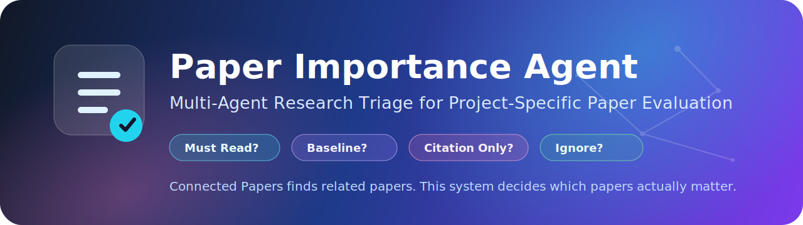
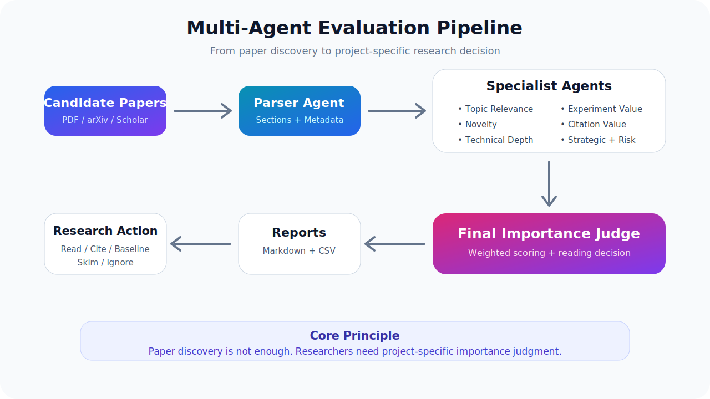
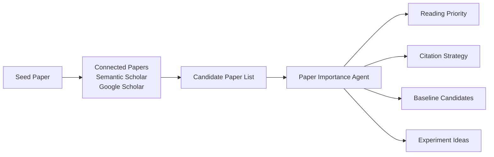
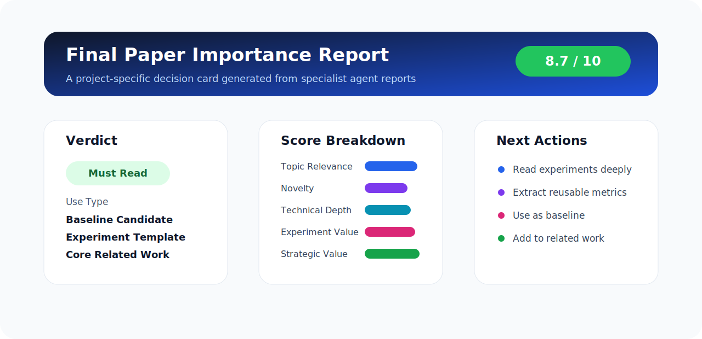

<p align="center">
  
</p>

<p align="center">
  <a href="#"></a>
  <a href="#"></a>
  <a href="#"></a>
  <a href="#"></a>
  <a href="#"></a>
</p>

<h1 align="center">Multi-Agent Paper Importance Evaluation System</h1>

<p align="center">
  <b>A research triage agent that decides which papers actually matter for your project.</b>
</p>

<p align="center">
  <i>Connected Papers finds related papers. This system decides which papers are worth reading, citing, reproducing, or ignoring.</i>
</p>

---

## ✨ What This Project Does

Most paper tools answer:

> “What is this paper about?”

This project answers a more useful research question:

> **“How important is this paper for my current research project?”**

The system evaluates each paper through multiple specialist agents and generates a final decision such as:

| Decision | Meaning |
|---|---|
| 🔥 **Must Read** | Core paper for the project |
| ⭐ **High Priority** | Important for related work, baseline, or experiment design |
| 🟡 **Read Selectively** | Useful, but only some sections matter |
| 👀 **Skim Only** | Read abstract, intro, conclusion |
| 🧾 **Citation Only** | Keep as weak/supporting citation |
| 🗑️ **Ignore** | Not worth spending time on |

---

## 🎯 Core Idea

Instead of asking a single LLM to judge a paper in one pass, this system uses **multiple specialized evaluation agents**.

<p align="center">
  
</p>

Each agent investigates one dimension of importance:

| Agent | Main Question |
|---|---|
| 🧭 **Topic Relevance Agent** | Is this paper relevant to my current project? |
| 💡 **Novelty Agent** | Is the contribution actually new? |
| 🧱 **Technical Depth Agent** | Is the method technically substantial? |
| 🧪 **Experiment Value Agent** | Can I reuse its metrics, baselines, or experiment design? |
| 🧾 **Citation Value Agent** | How should I cite this paper? |
| 🚀 **Strategic Value Agent** | Does it help my paper, portfolio, patent, or positioning? |
| ⚠️ **Weakness / Risk Agent** | What is weak, missing, or overclaimed? |
| ⚖️ **Final Judge Agent** | What is the final reading and usage decision? |

---

## 🧠 Why This Is Different

### Ordinary Paper Summarizer

```text
Paper → Summary
```

Typical output:

- Problem statement
- Proposed method
- Results
- Conclusion

### Paper Importance Agent

```text
Paper → Evidence → Multi-Agent Evaluation → Research Decision
```

Useful output:

- Should I read it?
- Should I cite it?
- Is it a baseline?
- Can I reuse the experiment?
- What gap does it leave open?
- Can I ignore it?

---

## 🔍 Relationship to Connected Papers

**Connected Papers** is excellent for literature discovery. It helps answer:

> “Which papers are related to this paper?”

This project goes one step further:

> “Among those related papers, which ones actually matter for my project?”



**Positioning:**

> Connected Papers finds related papers.  
> Paper Importance Agent decides which papers are important for a specific research project.

---

## 🧮 Scoring Model

The final score is computed from specialist agent scores.

```text
Final Score =
0.20 × Topic Relevance
0.15 × Novelty
0.15 × Technical Depth
0.15 × Experiment Value
0.15 × Citation Value
0.15 × Strategic Value
- 0.10 × Weakness Severity
```

Decision rule:

| Final Score | Decision |
|---:|---|
| 8.5 – 10.0 | 🔥 Must Read |
| 7.0 – 8.4 | ⭐ High Priority |
| 5.5 – 6.9 | 🟡 Read Selectively |
| 4.0 – 5.4 | 👀 Skim Only |
| 2.0 – 3.9 | 🧾 Citation Only |
| 0.0 – 1.9 | 🗑️ Ignore |

---

## 📊 Example Output Card

<p align="center">
  
</p>

The final report contains:

- Final verdict
- Final importance score
- Score breakdown
- Recommended reading depth
- Citation usage
- Baseline/competitor classification
- Weakness analysis
- Concrete action items

---

## 📁 Recommended Repository Structure

```text
paper_importance_agent/
├── README.md
├── assets/
│   ├── banner.svg
│   ├── architecture.svg
│   └── scorecard.svg
├── papers/
│   ├── paper_001.pdf
│   └── paper_002.pdf
├── context/
│   └── project_context.md
├── prompts/
│   ├── parser_agent.md
│   ├── topic_relevance_agent.md
│   ├── novelty_agent.md
│   ├── technical_depth_agent.md
│   ├── experiment_value_agent.md
│   ├── citation_value_agent.md
│   ├── strategic_value_agent.md
│   ├── weakness_risk_agent.md
│   └── final_judge_agent.md
├── reports/
│   ├── paper_001/
│   │   ├── parsed_structure.md
│   │   ├── topic_relevance.md
│   │   ├── novelty.md
│   │   ├── technical_depth.md
│   │   ├── experiment_value.md
│   │   ├── citation_value.md
│   │   ├── strategic_value.md
│   │   ├── weakness_risk.md
│   │   └── final_report.md
│   └── ranking_table.csv
├── src/
│   ├── pdf_parser.py
│   ├── agent_runner.py
│   ├── scoring.py
│   ├── report_writer.py
│   └── main.py
└── examples/
    └── sample_report.md
```

---

## 🚀 MVP Roadmap

### v0.1 — Local Paper Triage

- [ ] Load PDF files from `papers/`
- [ ] Extract title, abstract, introduction, method, experiments, conclusion
- [ ] Run specialist agent prompts
- [ ] Generate one Markdown report per paper
- [ ] Generate `ranking_table.csv`

### v0.2 — Multi-Paper Ranking

- [ ] Rank papers by final score
- [ ] Group papers into Must Read / Skim / Ignore
- [ ] Export related work candidates
- [ ] Export baseline candidates

### v0.3 — Research Writing Assistant

- [ ] Generate citation sentences
- [ ] Extract reusable metrics
- [ ] Suggest experiment designs
- [ ] Identify research gaps

### v0.4 — Literature Discovery Integration

- [ ] Use Connected Papers / Semantic Scholar / arXiv as candidate sources
- [ ] Build paper graph
- [ ] Run importance evaluation on discovered papers

---

## 🧩 Project Context Example

The agent should evaluate papers relative to a specific project context.

Example:

```markdown
# Project Context

## Current Research Direction

LLM-orchestrated RTL/FPGA verification.

The main idea is to treat the LLM not as a one-shot RTL generator, but as a verification orchestrator that coordinates:

- specification analysis
- RTL generation
- testbench generation
- simulation
- failure detection
- debugging
- patch generation
- synthesis check
- FPGA board execution
- board-level log feedback

## Important Keywords

- LLM-assisted RTL verification
- testbench generation
- FPGA validation
- AXI-Lite / AXI-Stream debugging
- Vivado xsim
- synthesis / implementation
- UART logs
- board-level status counters
- simulation-to-board mismatch
```

---

## 📝 Example Final Report Format

```markdown
# Final Paper Importance Report

## 1. Final Verdict

🔥 Must Read

## 2. Final Importance Score

- Final Score: 8.7 / 10
- Priority: High
- Confidence: High

## 3. How This Paper Should Be Used

- Core Related Work
- Baseline Candidate
- Experiment Template
- Metric Source

## 4. Reading Plan

- Abstract: Read
- Introduction: Read deeply
- Method: Read selectively
- Experiments: Read deeply
- Appendix: Skim

## 5. Action Items

1. Extract the evaluation metrics.
2. Compare the baseline method against the proposed workflow.
3. Cite this paper in the related work section.
4. Reuse the experiment table structure.
```

---

## 🧪 Core Specialist Agents

### 🧭 Topic Relevance Agent

Evaluates whether the paper matches the user's current research direction.

Output:

```markdown
## Topic Relevance Score
- Score:
- Confidence:

## Relevant Parts
...

## Evidence
...

## Final Verdict
Directly Relevant / Partially Relevant / Weakly Relevant / Not Relevant
```

### 💡 Novelty Agent

Evaluates whether the contribution is genuinely new.

Output:

```markdown
## Novelty Score
- Score:
- Confidence:

## Claimed Contributions
...

## Actual Contributions
...

## Final Verdict
Strong Novelty / Moderate Novelty / Incremental Novelty / Weak Novelty
```

### 🧪 Experiment Value Agent

Evaluates whether the experimental setup is useful.

Output:

```markdown
## Experiment Value Score
- Score:
- Confidence:

## Useful Experimental Elements
...

## Reusable Metrics
...

## Extension Ideas
...
```

### ⚠️ Weakness / Risk Agent

Critically evaluates missing evidence, weak baselines, and overclaims.

Output:

```markdown
## Weakness Severity Score
- Score:
- Confidence:

## Main Weaknesses
...

## Missing Evidence
...

## How the User Can Improve Beyond This Paper
...
```

---

## 🖥️ Future CLI

```bash
paper-agent scan ./papers \
  --project-context ./context/project_context.md \
  --output ./reports
```

Expected output:

```text
[INFO] Found 12 PDF files.
[INFO] Parsing papers...
[INFO] Running specialist agents...
[INFO] Generating final reports...
[INFO] Writing ranking_table.csv...
[DONE] Reports saved to ./reports
```

---

## 🏁 One-Line Summary

> This project builds a multi-agent research triage system that evaluates papers by project-specific importance, not just by generic relevance or citation count.
