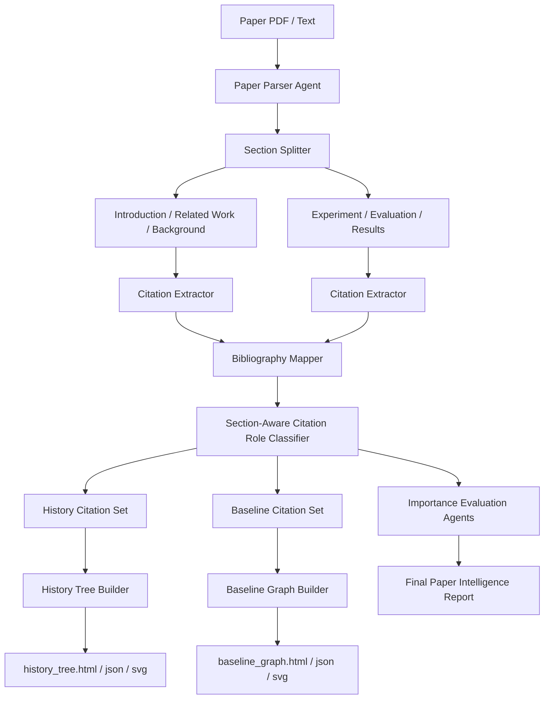

# PaperNav

<p align="center">
  <b>Section-Aware Paper Intelligence Agent</b>
</p>

<p align="center">
  Visualize paper history, baseline relationships, and project-specific importance.
</p>

<p align="center">
  <i>Connected Papers shows how papers are connected. PaperNav shows why each reference appears in a paper.</i>
</p>

---

## 1. Project Overview

**PaperNav** is a section-aware paper intelligence system.

The goal is not only to summarize a paper, but to analyze how references are used inside the paper and convert them into useful research maps.

A research paper uses references differently depending on where they appear:

| Paper Section | Meaning of References | Visualization |
|---|---|---|
| Introduction / Related Work / Background | Historical evolution, foundational work, prior research flow | **History Tree** |
| Experiment / Evaluation / Results | Baselines, competitors, benchmark sources, metric sources | **Baseline Graph** |
| Whole Paper | Project-specific relevance and importance | **Importance Report** |

The core idea is:

> Introduction references reveal the historical evolution of a field.  
> Experiment references reveal the actual baseline and competitor landscape.

---

## 2. Motivation

Existing tools such as Connected Papers are useful for discovering related papers. They show which papers are connected to each other.

However, they usually do not answer:

- Why is this reference cited in this paper?
- Is this reference part of the historical background?
- Is this reference a direct baseline?
- Is this reference a benchmark or metric source?
- Which papers should I read first to understand the field?
- Which papers should I compare against in my own experiments?
- Which papers are only weak citations?
- Which papers can be ignored?

PaperNav aims to answer these questions by analyzing **where** and **how** references appear inside a target paper.

---

## 3. Core Concept

PaperNav separates references into two major views.

---

### 3.1 History Tree View

References that appear in:

- Introduction
- Related Work
- Background
- Motivation

are treated as historical or conceptual references.

These references help answer:

```text
How did this research field evolve?
Which papers are foundational?
Which papers are direct prior work?
Which papers should I read first to understand the background?
```

The output is a **History Tree**.

Example conceptual structure:

```text
Foundational Work
   └── Classical Prior Work
          └── Recent Related Work
                 └── Target Paper
```

---

### 3.2 Baseline Graph View

References that appear in:

- Experiment
- Evaluation
- Results
- Comparison
- Ablation Study
- Discussion

are treated as experimental comparison references.

These references help answer:

```text
Which methods are used as baselines?
Which methods are competitors?
Which benchmark or dataset is used?
Which metric is used?
Which methods are directly compared?
```

The output is a **Baseline Graph**.

Example conceptual structure:

```text
            Baseline A
               |
Baseline B -- Target Paper -- Baseline C
               |
          Benchmark / Metric Source
```

---

## 4. System Architecture



---

## 5. Main Components

### 5.1 Paper Parser Agent

The Paper Parser Agent converts raw PDF or text into structured paper sections.

Input:

```text
PDF file
or
plain text paper
```

Output:

```json
{
  "paper_id": "paper_001",
  "title": "...",
  "authors": ["..."],
  "abstract": "...",
  "sections": {
    "introduction": "...",
    "related_work": "...",
    "method": "...",
    "experiments": "...",
    "results": "...",
    "conclusion": "...",
    "references": "..."
  },
  "raw_text": "..."
}
```

---

### 5.2 Citation Extractor

The Citation Extractor finds citation markers in each section.

Supported citation patterns for MVP:

```text
[1]
[1, 2]
[1]-[4]
[1–4]
Smith et al. (2022)
(Smith et al., 2022)
```

Initial MVP will focus on numeric citations first.

Example output:

```json
{
  "citation_id": "ref_12",
  "marker": "[12]",
  "section_name": "introduction",
  "sentence": "Recent works such as [12] and [13] explored LLM-based RTL generation.",
  "context_window": "..."
}
```

---

### 5.3 Bibliography Mapper

The Bibliography Mapper connects citation markers to reference entries.

Example input:

```text
[12] A. Smith and B. Lee, "LLM-assisted RTL Verification", DAC, 2025.
```

Example output:

```json
{
  "citation_id": "ref_12",
  "raw_text": "[12] A. Smith and B. Lee, \"LLM-assisted RTL Verification\", DAC, 2025.",
  "title": "LLM-assisted RTL Verification",
  "authors": ["A. Smith", "B. Lee"],
  "year": 2025,
  "venue": "DAC"
}
```

---

### 5.4 Section-Aware Citation Role Classifier

This is the core intelligence module.

The same citation can have different meaning depending on where it appears.

#### Introduction / Related Work Citations

Likely roles:

```text
history_foundational
history_direct_prior
history_background
supporting_evidence
```

#### Experiment / Evaluation Citations

Likely roles:

```text
baseline_direct
baseline_extended
competitor
benchmark_source
metric_source
```

#### Rule Examples

| Context Pattern | Citation Role |
|---|---|
| "first proposed", "pioneering", "classical" | history_foundational |
| "prior work", "previous studies", "recent works" | history_direct_prior |
| "we compare with", "compared against", "baseline" | baseline_direct |
| "outperforms", "against", "state-of-the-art" | competitor |
| "benchmark", "dataset", "evaluation protocol" | benchmark_source |
| "metric", "score", "measurement" | metric_source |

---

### 5.5 History Tree Builder

The History Tree Builder uses references from:

- Introduction
- Related Work
- Background

to create a historical learning path.

Output files:

```text
history_tree.json
history_tree.html
history_tree.svg
history_tree_summary.md
```

Node attributes:

```json
{
  "citation_id": "ref_12",
  "title": "LLM-assisted RTL Verification",
  "year": 2025,
  "role": "history_direct_prior",
  "citation_frequency": 3,
  "importance_hint": "direct prior work"
}
```

Visualization rule:

| Visual Feature | Meaning |
|---|---|
| Node position | Historical order |
| Node size | Citation frequency |
| Node color | Citation role |
| Edge direction | Evolution path |
| Target paper | Final/root node |

---

### 5.6 Baseline Graph Builder

The Baseline Graph Builder uses references from:

- Experiment
- Evaluation
- Results
- Comparison
- Ablation Study

to create an experimental comparison map.

Output files:

```text
baseline_graph.json
baseline_graph.html
baseline_graph.svg
baseline_graph_summary.md
```

Node types:

```text
target_paper
baseline_direct
competitor
benchmark_source
metric_source
supporting_reference
```

Edge types:

```text
compared_against
same_benchmark
same_metric
same_method_family
competitor_relation
```

Visualization rule:

| Visual Feature | Meaning |
|---|---|
| Center node | Target paper |
| Orange node | Direct baseline |
| Yellow node | Competitor |
| Green node | Benchmark source |
| Cyan node | Metric source |
| Edge thickness | Relation strength |

---

### 5.7 Importance Evaluation Agents

After citation role analysis and graph construction, PaperNav evaluates the importance of the paper for the user's project.

Initial specialist agents:

| Agent | Question |
|---|---|
| Topic Relevance Agent | Is this paper relevant to my project? |
| Citation Value Agent | How should this paper be cited? |
| Experiment Value Agent | Can I reuse its baselines or metrics? |
| Strategic Value Agent | Does this paper expose a useful research gap? |
| Weakness / Risk Agent | What is weak or overclaimed? |
| Final Judge Agent | What is the final reading decision? |

---

## 6. Data Models

### 6.1 ParsedPaper

```python
class ParsedPaper:
    paper_id: str
    title: str | None
    authors: list[str]
    abstract: str | None
    sections: dict[str, str]
    raw_text: str
    metadata: dict
```

---

### 6.2 CitationMention

```python
class CitationMention:
    citation_id: str
    marker: str
    section_name: str
    sentence: str
    context_window: str
    role: str | None
```

---

### 6.3 BibliographyEntry

```python
class BibliographyEntry:
    citation_id: str
    raw_text: str
    title: str | None
    authors: list[str]
    year: int | None
    venue: str | None
```

---

### 6.4 CitationRole

```python
class CitationRole:
    citation_id: str
    role: str
    confidence: str
    evidence_sentence: str
    section_name: str
```

---

### 6.5 HistoryTreeNode

```python
class HistoryTreeNode:
    node_id: str
    citation_id: str
    title: str
    year: int | None
    role: str
    citation_frequency: int
    parent_id: str | None
```

---

### 6.6 BaselineGraphNode

```python
class BaselineGraphNode:
    node_id: str
    citation_id: str
    title: str
    year: int | None
    node_type: str
    role: str
```

---

### 6.7 BaselineGraphEdge

```python
class BaselineGraphEdge:
    source: str
    target: str
    edge_type: str
    weight: float
    reason: str
```

---

## 7. Output Structure

For each target paper:

```text
reports/
└── paper_001/
    ├── parsed_paper.json
    ├── citation_mentions.json
    ├── bibliography_entries.json
    ├── citation_roles.json
    ├── citation_roles.md
    ├── history_tree.json
    ├── history_tree.html
    ├── history_tree.svg
    ├── history_tree_summary.md
    ├── baseline_graph.json
    ├── baseline_graph.html
    ├── baseline_graph.svg
    ├── baseline_graph_summary.md
    ├── topic_relevance.md
    └── final_report.md
```

For multi-paper processing:

```text
reports/
├── ranking_table.csv
├── global_paper_graph.html
├── global_paper_graph.json
├── paper_001/
├── paper_002/
└── paper_003/
```

---

## 8. Recommended Repository Structure

```text
papernav/
├── README.md
├── pyproject.toml
├── .gitignore
├── assets/
│   ├── history_tree_example.svg
│   ├── baseline_graph_example.svg
│   └── architecture.svg
├── docs/
│   ├── project_context.md
│   ├── roadmap.md
│   ├── citation_roles.md
│   └── graph_design.md
├── prompts/
│   ├── 00_bootstrap_repository.md
│   ├── 01_define_common_models.md
│   ├── 02_build_paper_parser.md
│   ├── 03_build_citation_extractor.md
│   ├── 04_build_bibliography_mapper.md
│   ├── 05_build_citation_role_classifier.md
│   ├── 06_build_history_tree_builder.md
│   ├── 07_build_baseline_graph_builder.md
│   ├── 08_build_graph_visualizer.md
│   ├── 09_build_topic_relevance_agent.md
│   ├── 10_build_final_importance_judge.md
│   ├── 11_build_report_generator.md
│   ├── 12_build_batch_pipeline.md
│   ├── 13_add_readme_and_example_figures.md
│   └── 14_add_end_to_end_tests.md
├── examples/
│   ├── sample_paper.txt
│   ├── sample_parsed_paper.json
│   └── sample_outputs/
├── papers/
├── reports/
├── tests/
└── src/
    └── papernav/
        ├── __init__.py
        ├── models.py
        ├── parser.py
        ├── pipeline.py
        ├── report_writer.py
        ├── citation/
        │   ├── __init__.py
        │   ├── extractor.py
        │   ├── bibliography.py
        │   └── classifier.py
        ├── graph/
        │   ├── __init__.py
        │   ├── history_tree.py
        │   ├── baseline_graph.py
        │   └── visualizer.py
        └── agents/
            ├── __init__.py
            ├── topic_relevance.py
            ├── citation_value.py
            ├── experiment_value.py
            ├── strategic_value.py
            ├── weakness_risk.py
            └── final_judge.py
```

---

## 9. Development Roadmap

---

### Step 00 — Repository Bootstrap

Goal:

Create the initial repository structure.

Deliverables:

```text
src/
tests/
docs/
prompts/
assets/
examples/
papers/
reports/
README.md
pyproject.toml
.gitignore
```

Completion criteria:

- Repository structure exists
- Python package imports successfully
- Basic smoke test passes
- Prompt archive directory exists

---

### Step 01 — Define Common Data Models

Goal:

Define shared data models used across all agents and graph modules.

Deliverables:

```text
src/papernav/models.py
tests/test_models.py
docs/data_models.md
```

Required models:

```text
ParsedPaper
CitationMention
BibliographyEntry
CitationRole
HistoryTreeNode
BaselineGraphNode
BaselineGraphEdge
AgentReport
FinalImportanceReport
```

Completion criteria:

- Models are serializable to JSON
- Tests cover model creation and validation
- Models are documented

---

### Step 02 — Build Paper Parser

Goal:

Parse PDF or text into structured paper sections.

Deliverables:

```text
src/papernav/parser.py
tests/test_parser.py
examples/sample_parsed_paper.json
docs/parser.md
```

Completion criteria:

- Sample paper text can be parsed
- Sections are extracted
- References section is detected
- Parsed output is saved as JSON

---

### Step 03 — Build Citation Extractor

Goal:

Extract citation mentions from each paper section.

Deliverables:

```text
src/papernav/citation/extractor.py
tests/test_citation_extractor.py
docs/citation_extractor.md
```

Completion criteria:

- Numeric citations are detected
- Citation ranges are expanded
- Citation sentence is captured
- Section name is stored
- Citation mention JSON is generated

---

### Step 04 — Build Bibliography Mapper

Goal:

Extract bibliography entries and map them to citation IDs.

Deliverables:

```text
src/papernav/citation/bibliography.py
tests/test_bibliography_mapper.py
docs/bibliography_mapper.md
```

Completion criteria:

- Reference entries are split
- Citation IDs are assigned
- Title/year extraction works for common patterns
- Citation mention ↔ bibliography entry mapping works

---

### Step 05 — Build Section-Aware Citation Role Classifier

Goal:

Classify each citation based on section and sentence context.

Deliverables:

```text
src/papernav/citation/classifier.py
tests/test_citation_role_classifier.py
docs/citation_role_classifier.md
```

Role labels:

```text
history_foundational
history_direct_prior
history_background
baseline_direct
baseline_extended
competitor
benchmark_source
metric_source
supporting_evidence
misc
```

Completion criteria:

- Introduction citations are classified as history roles
- Experiment citations are classified as baseline/competitor roles
- Keyword-based rules work
- Citation role report is generated

---

### Step 06 — Build History Tree Builder

Goal:

Create a history tree from Introduction / Related Work citations.

Deliverables:

```text
src/papernav/graph/history_tree.py
tests/test_history_tree.py
docs/history_tree.md
```

Output:

```text
history_tree.json
history_tree_summary.md
```

Completion criteria:

- History citations are selected
- Nodes are sorted by year and role
- Target paper is included
- JSON tree is generated

---

### Step 07 — Build Baseline Graph Builder

Goal:

Create a baseline graph from Experiment / Evaluation citations.

Deliverables:

```text
src/papernav/graph/baseline_graph.py
tests/test_baseline_graph.py
docs/baseline_graph.md
```

Output:

```text
baseline_graph.json
baseline_graph_summary.md
```

Completion criteria:

- Baseline citations are selected
- Target paper is center node
- Baseline and competitor nodes are connected
- Edge types are assigned

---

### Step 08 — Build Graph Visualizer

Goal:

Export History Tree and Baseline Graph as interactive HTML and static SVG.

Recommended tools for MVP:

```text
NetworkX
PyVis
Matplotlib or Graphviz for static output
```

Deliverables:

```text
src/papernav/graph/visualizer.py
tests/test_graph_visualizer.py
docs/graph_visualizer.md
assets/history_tree_example.svg
assets/baseline_graph_example.svg
```

Completion criteria:

- `history_tree.html` is generated
- `baseline_graph.html` is generated
- Example SVGs are generated
- README can reference example figures

---

### Step 09 — Build Topic Relevance Agent

Goal:

Evaluate whether the target paper is relevant to the user’s project context.

Deliverables:

```text
src/papernav/agents/topic_relevance.py
tests/test_topic_relevance_agent.py
docs/topic_relevance_agent.md
```

Input:

```text
ParsedPaper
CitationRole list
History Tree summary
Baseline Graph summary
Project context
```

Completion criteria:

- Score between 0 and 10
- Evidence list generated
- Weakness list generated
- Markdown report generated

---

### Step 10 — Build Final Importance Judge

Goal:

Combine paper information, citation roles, graph summaries, and agent reports into a final decision.

Deliverables:

```text
src/papernav/agents/final_judge.py
src/papernav/scoring.py
tests/test_final_judge.py
docs/final_judge.md
```

Decision labels:

```text
Must Read
High Priority
Read Selectively
Skim Only
Citation Only
Ignore
```

Completion criteria:

- Final score is computed
- Verdict threshold works
- Reading plan generated
- Citation strategy generated
- Research gap generated

---

### Step 11 — Build Report Generator

Goal:

Generate Markdown reports and CSV ranking tables.

Deliverables:

```text
src/papernav/report_writer.py
tests/test_report_writer.py
docs/report_generator.md
```

Final report structure:

```markdown
# Paper Intelligence Report

## 1. Final Verdict
## 2. Importance Score
## 3. History Tree Summary
## 4. Baseline Graph Summary
## 5. Citation Role Summary
## 6. Topic Relevance
## 7. How to Read This Paper
## 8. How to Use This Paper
## 9. Research Gap
## 10. Action Items
```

Completion criteria:

- Markdown report generated
- CSV ranking table generated
- Required headings exist
- Output paths are deterministic

---

### Step 12 — Build Batch Pipeline

Goal:

Run PaperNav on a folder of papers.

CLI target:

```bash
papernav scan ./papers \
  --context ./docs/project_context.md \
  --output ./reports \
  --history-tree \
  --baseline-graph
```

Deliverables:

```text
src/papernav/pipeline.py
src/papernav/main.py
tests/test_pipeline.py
docs/batch_pipeline.md
```

Completion criteria:

- Multiple papers processed
- Per-paper reports generated
- Ranking table generated
- Graph outputs generated
- Empty folder handled gracefully

---

### Step 13 — Add README and Example Figures

Goal:

Make the project visually understandable on GitHub.

Deliverables:

```text
README.md
assets/history_tree_example.svg
assets/baseline_graph_example.svg
assets/architecture.svg
```

README must include:

- Project overview
- History Tree explanation
- Baseline Graph explanation
- System architecture
- Roadmap
- Example outputs
- CLI usage
- Prompt archive policy

Completion criteria:

- README renders cleanly on GitHub
- Figures are visible
- Mermaid diagram renders
- Installation and usage instructions exist

---

### Step 14 — Add End-to-End Tests

Goal:

Validate the full MVP pipeline.

Deliverables:

```text
tests/test_end_to_end.py
examples/sample_paper.txt
examples/sample_outputs/
docs/testing.md
```

Completion criteria:

- Sample paper runs through full pipeline
- Citation roles are generated
- History tree is generated
- Baseline graph is generated
- Final report is generated
- Tests pass

---

## 10. Milestones

---

### Milestone 1 — Section-Aware Citation Extraction

Goal:

Build the foundation for section-aware reference analysis.

Completion checklist:

```text
[ ] Paper text is split into sections
[ ] Introduction citations are extracted
[ ] Experiment citations are extracted
[ ] Reference section is parsed
[ ] Citation markers are mapped to bibliography entries
[ ] Each citation mention stores its section and sentence
[ ] citation_roles.json is generated
```

---

### Milestone 2 — History Tree + Baseline Graph

Goal:

Visualize reference roles.

Completion checklist:

```text
[ ] Introduction references generate history_tree.json
[ ] Introduction references generate history_tree.html
[ ] Experiment references generate baseline_graph.json
[ ] Experiment references generate baseline_graph.html
[ ] Static example figures are generated
[ ] README includes both visualizations
```

---

### Milestone 3 — Importance Agent Integration

Goal:

Add project-specific paper importance evaluation.

Completion checklist:

```text
[ ] Topic Relevance Agent implemented
[ ] Citation Value Agent implemented
[ ] Experiment Value Agent implemented
[ ] Final Judge implemented
[ ] Final Paper Intelligence Report generated
```

---

### Milestone 4 — Batch Research Navigation Tool

Goal:

Process multiple papers and generate research maps.

Completion checklist:

```text
[ ] Folder-level paper processing works
[ ] Ranking table generated
[ ] Per-paper history trees generated
[ ] Per-paper baseline graphs generated
[ ] Global paper graph generated
[ ] Example output committed
```

---

## 11. Claude Prompt Plan

Every Claude Code prompt must be saved under:

```text
prompts/
```

Recommended prompt sequence:

```text
00_bootstrap_repository.md
01_define_common_models.md
02_build_paper_parser.md
03_build_citation_extractor.md
04_build_bibliography_mapper.md
05_build_citation_role_classifier.md
06_build_history_tree_builder.md
07_build_baseline_graph_builder.md
08_build_graph_visualizer.md
09_build_topic_relevance_agent.md
10_build_final_importance_judge.md
11_build_report_generator.md
12_build_batch_pipeline.md
13_add_readme_and_example_figures.md
14_add_end_to_end_tests.md
```

Each prompt should include:

```text
- Working directory
- Objective
- Context
- Allowed modifications
- Files to create or modify
- Implementation requirements
- Tests
- Documentation updates
- Final report format
```

---

## 12. MVP Scope

The first MVP should avoid external APIs.

### Included in MVP

```text
- Local PDF/text parsing
- Numeric citation extraction
- Bibliography mapping
- Rule-based citation role classification
- History tree JSON generation
- Baseline graph JSON generation
- Simple HTML visualization
- Markdown report generation
- CLI batch processing
```

### Not Included in MVP

```text
- Semantic Scholar API
- OpenAlex API
- arXiv API
- Connected Papers integration
- LLM API backend
- Full D3.js web application
- Perfect reference parsing
```

---

## 13. Future Extensions

### 13.1 Semantic Citation Enrichment

Use external APIs to enrich bibliography entries:

```text
Semantic Scholar
OpenAlex
Crossref
arXiv
Google Scholar-like metadata sources
```

Possible enriched fields:

```text
citation count
abstract
venue
influential citations
references
citations
field of study
```

---

### 13.2 LLM-Based Citation Role Classification

Replace or augment rule-based classification with LLM reasoning.

Example:

```text
Given the citation sentence and section,
classify whether this reference is a foundational work,
direct prior work, baseline, competitor, benchmark source, metric source, or supporting evidence.
```

---

### 13.3 Global Research Map

Build a graph across multiple target papers.

```text
global_history_map.html
global_baseline_landscape.html
global_research_gap_map.html
```

---

### 13.4 React + D3 Web Viewer

Upgrade visualization from PyVis/NetworkX to a professional web interface.

Potential views:

```text
History Tree View
Baseline Graph View
Citation Role Table
Paper Importance Dashboard
Reading Plan View
```

---

### 13.5 Research Writing Assistant

Use the extracted citation roles to generate:

```text
Related Work section
Baseline comparison paragraph
Experiment design checklist
Research gap paragraph
Citation sentence suggestions
```

---

## 14. Example CLI

Single paper:

```bash
papernav analyze ./papers/target_paper.pdf \
  --context ./docs/project_context.md \
  --output ./reports/target_paper
```

Folder of papers:

```bash
papernav scan ./papers \
  --context ./docs/project_context.md \
  --output ./reports \
  --history-tree \
  --baseline-graph
```

Expected output:

```text
[INFO] Parsing paper...
[INFO] Extracting citations...
[INFO] Mapping bibliography entries...
[INFO] Classifying citation roles...
[INFO] Building history tree...
[INFO] Building baseline graph...
[INFO] Evaluating paper importance...
[INFO] Writing final report...
[DONE] Reports saved to ./reports
```

---

## 15. Research Positioning

PaperNav can be positioned as:

```text
A section-aware paper intelligence system for visualizing the role of references inside scientific papers.
```

More specifically:

```text
A research navigation tool that separates historical references from experimental baseline references and converts them into interpretable visual maps.
```

Key differentiator:

> PaperNav does not only ask which papers are related.  
> It asks why each reference appears and how the researcher should use it.

---

## 16. One-Line Summary

> PaperNav transforms references inside a paper into a History Tree, a Baseline Graph, and a project-specific importance report.
