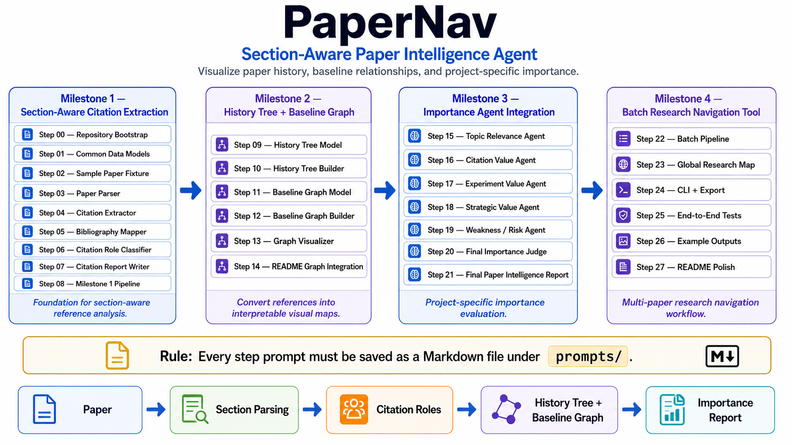
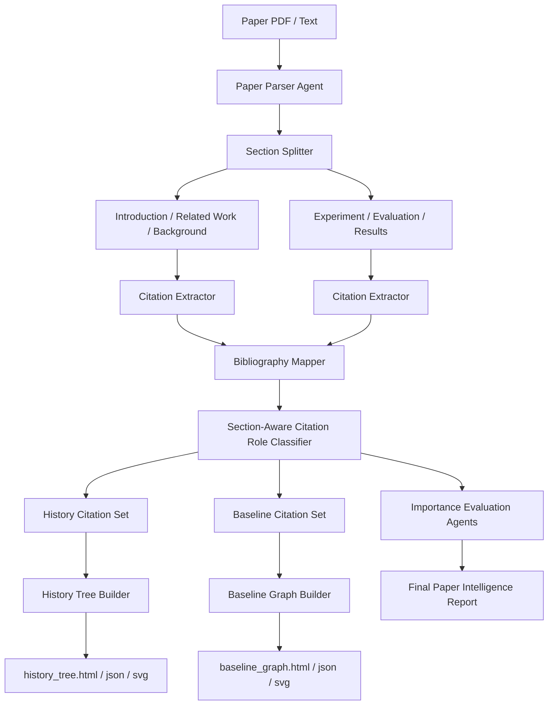
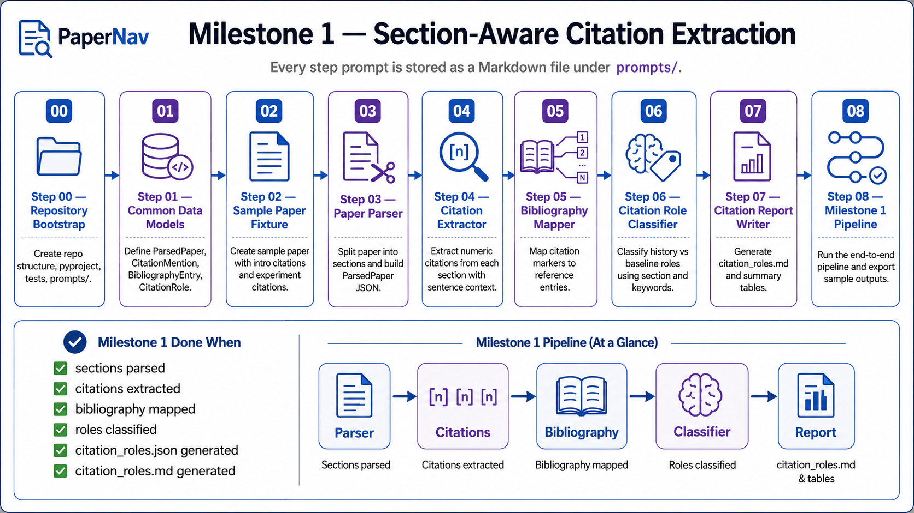

# PaperNav

<p align="center">
  <b>Section-Aware Paper Intelligence Agent</b>
</p>

<p align="center">
  Visualize paper history, baseline relationships, and project-specific importance.
</p>

<p align="center">
  <i>Connected Papers shows how papers are connected. PaperNav shows why each reference appears in a paper.</i>
</p>

<p align="center">
  
</p>

---

## 1. Overview

**PaperNav** is a section-aware paper intelligence system.

The goal is not only to summarize a paper, but to analyze how references are used inside the paper and convert them into useful research maps.

A research paper uses references differently depending on where they appear:

| Paper Section | Meaning of References | Visualization |
|---|---|---|
| Introduction / Related Work / Background | Historical evolution, foundational work, prior research flow | **History Tree** |
| Experiment / Evaluation / Results | Baselines, competitors, benchmark sources, metric sources | **Baseline Graph** |
| Whole Paper | Project-specific relevance and importance | **Importance Report** |

Core idea:

> Introduction references reveal the historical evolution of a field.  
> Experiment references reveal the actual baseline and competitor landscape.

---

## 2. Motivation

Existing tools such as Connected Papers are useful for discovering related papers. They show which papers are connected to each other.

However, they usually do not answer:

- Why is this reference cited in this paper?
- Is this reference part of the historical background?
- Is this reference a direct baseline?
- Is this reference a benchmark or metric source?
- Which papers should I read first to understand the field?
- Which papers should I compare against in my own experiments?
- Which papers are only weak citations?
- Which papers can be ignored?

PaperNav aims to answer these questions by analyzing **where** and **how** references appear inside a target paper.

---

## 3. Key Differentiation

Most paper tools are paper-level tools.

```text
Paper
  ↓
Summary
```

PaperNav is a section-aware reference intelligence tool.

```text
Paper
  ↓
Section Parsing
  ↓
Citation Role Analysis
  ↓
History Tree + Baseline Graph
  ↓
Project-Specific Importance Report
```

Positioning:

> Connected Papers shows how papers are connected.  
> PaperNav shows why each reference appears in a paper.

---

## 4. System Architecture



---

## 5. Roadmap

PaperNav is built step by step.

Every Claude Code prompt used to build the system must be saved as a Markdown file under `prompts/`.

### Milestone Overview

| Milestone | Goal | Output |
|---|---|---|
| **Milestone 1** | Section-aware citation extraction | `citation_roles.json`, `citation_roles.md` |
| **Milestone 2** | History Tree + Baseline Graph | `history_tree.html`, `baseline_graph.html` |
| **Milestone 3** | Importance Agent integration | `final_report.md` |
| **Milestone 4** | Batch research navigation tool | folder-level reports and global research map |

---

## 6. Prompt Archive Rule

> **Rule:** Every step prompt must be saved as a Markdown file under `prompts/`.

This repository follows a strict prompt-traceable development workflow.

```text
prompts/
├── 00_bootstrap_repository.md
├── 01_define_common_models.md
├── 02_add_sample_paper_fixture.md
├── 03_build_paper_parser.md
├── 04_build_citation_extractor.md
├── 05_build_bibliography_mapper.md
├── 06_build_citation_role_classifier.md
├── 07_build_citation_report_writer.md
├── 08_add_milestone1_pipeline.md
├── 09_build_history_tree_model.md
├── 10_build_history_tree_builder.md
├── 11_build_baseline_graph_model.md
├── 12_build_baseline_graph_builder.md
├── 13_build_graph_visualizer.md
├── 14_add_readme_graph_integration.md
├── 15_build_topic_relevance_agent.md
├── 16_build_citation_value_agent.md
├── 17_build_experiment_value_agent.md
├── 18_build_strategic_value_agent.md
├── 19_build_weakness_risk_agent.md
├── 20_build_final_importance_judge.md
├── 21_build_final_paper_intelligence_report.md
├── 22_build_batch_pipeline.md
├── 23_build_global_research_map.md
├── 24_add_cli_and_export.md
├── 25_add_end_to_end_tests.md
├── 26_add_example_outputs.md
└── 27_polish_readme.md
```

Each prompt should include:

```text
- Working directory
- Objective
- Context
- Allowed modifications
- Files to create or modify
- Implementation requirements
- Tests
- Documentation updates
- Final report format
```

---

## 7. Milestone 1 — Section-Aware Citation Extraction

The first milestone builds the foundation for section-aware reference analysis.

The goal is to convert a paper into structured citation-role information.

```text
Paper
  ↓
Section Parsing
  ↓
Citation Extraction
  ↓
Bibliography Mapping
  ↓
Citation Role Classification
  ↓
citation_roles.json / citation_roles.md
```

<p align="center">
  
</p>

### Milestone 1 Steps

| Step | Prompt File | Purpose |
|---:|---|---|
| 00 | `prompts/00_bootstrap_repository.md` | Create repository structure, `pyproject.toml`, tests, and `prompts/` |
| 01 | `prompts/01_define_common_models.md` | Define shared data models |
| 02 | `prompts/02_add_sample_paper_fixture.md` | Create sample paper fixture with introduction and experiment citations |
| 03 | `prompts/03_build_paper_parser.md` | Split paper into sections and build `ParsedPaper` JSON |
| 04 | `prompts/04_build_citation_extractor.md` | Extract numeric citations from each section with sentence context |
| 05 | `prompts/05_build_bibliography_mapper.md` | Map citation markers to reference entries |
| 06 | `prompts/06_build_citation_role_classifier.md` | Classify history vs. baseline roles using section and keywords |
| 07 | `prompts/07_build_citation_report_writer.md` | Generate `citation_roles.md` and summary tables |
| 08 | `prompts/08_add_milestone1_pipeline.md` | Run the end-to-end Milestone 1 pipeline and export sample outputs |

### Milestone 1 Done When

- [ ] Paper sections are parsed
- [ ] Citations are extracted from each section
- [ ] Bibliography entries are mapped
- [ ] Citation roles are classified
- [ ] `citation_roles.json` is generated
- [ ] `citation_roles.md` is generated
- [ ] End-to-end sample pipeline passes

---

## 8. Milestone 2 — History Tree + Baseline Graph

Milestone 2 converts citation roles into visual maps.

### History Tree

References from:

- Introduction
- Related Work
- Background
- Motivation

are used to build a **History Tree**.

This tree helps answer:

```text
How did this field evolve?
Which papers are foundational?
Which papers are direct prior work?
Which papers should I read first?
```

### Baseline Graph

References from:

- Experiment
- Evaluation
- Results
- Comparison
- Ablation Study

are used to build a **Baseline Graph**.

This graph helps answer:

```text
Which methods are direct baselines?
Which methods are competitors?
Which benchmarks are used?
Which metrics are used?
Which papers should I compare against?
```

### Milestone 2 Steps

| Step | Prompt File | Purpose |
|---:|---|---|
| 09 | `prompts/09_build_history_tree_model.md` | Define data model for history tree nodes and edges |
| 10 | `prompts/10_build_history_tree_builder.md` | Build history tree from introduction and related-work citations |
| 11 | `prompts/11_build_baseline_graph_model.md` | Define data model for baseline graph nodes and edges |
| 12 | `prompts/12_build_baseline_graph_builder.md` | Build baseline graph from experiment and evaluation citations |
| 13 | `prompts/13_build_graph_visualizer.md` | Export graph data to HTML/SVG/JSON |
| 14 | `prompts/14_add_readme_graph_integration.md` | Add graph examples to README |

### Milestone 2 Done When

- [ ] `history_tree.json` is generated
- [ ] `history_tree.html` is generated
- [ ] `baseline_graph.json` is generated
- [ ] `baseline_graph.html` is generated
- [ ] Static README graph figures are generated
- [ ] Graph summaries are included in the report

---

## 9. Milestone 3 — Importance Agent Integration

Milestone 3 adds project-specific paper importance evaluation.

At this point, PaperNav does not only know what references exist. It also knows:

- which references are historical
- which references are baselines
- which references are competitors
- whether the paper is important for the user's project

### Importance Agents

| Agent | Main Question |
|---|---|
| Topic Relevance Agent | Is this paper relevant to my project? |
| Citation Value Agent | How should this paper be cited? |
| Experiment Value Agent | Can I reuse its baselines or metrics? |
| Strategic Value Agent | Does this paper expose a useful research gap? |
| Weakness / Risk Agent | What is weak, missing, or overclaimed? |
| Final Judge Agent | What is the final reading decision? |

### Milestone 3 Steps

| Step | Prompt File | Purpose |
|---:|---|---|
| 15 | `prompts/15_build_topic_relevance_agent.md` | Evaluate project relevance |
| 16 | `prompts/16_build_citation_value_agent.md` | Evaluate citation usefulness |
| 17 | `prompts/17_build_experiment_value_agent.md` | Evaluate experiment and baseline usefulness |
| 18 | `prompts/18_build_strategic_value_agent.md` | Evaluate research positioning and gap value |
| 19 | `prompts/19_build_weakness_risk_agent.md` | Evaluate limitations and overclaim risk |
| 20 | `prompts/20_build_final_importance_judge.md` | Combine specialist scores into final verdict |
| 21 | `prompts/21_build_final_paper_intelligence_report.md` | Generate final paper intelligence report |

### Final Decision Labels

```text
Must Read
High Priority
Read Selectively
Skim Only
Citation Only
Ignore
```

### Milestone 3 Done When

- [ ] Topic Relevance Agent is implemented
- [ ] Citation Value Agent is implemented
- [ ] Experiment Value Agent is implemented
- [ ] Strategic Value Agent is implemented
- [ ] Weakness / Risk Agent is implemented
- [ ] Final Judge Agent is implemented
- [ ] `final_report.md` is generated

---

## 10. Milestone 4 — Batch Research Navigation Tool

Milestone 4 turns PaperNav into a multi-paper research navigation system.

### Goal

Process a folder of papers and generate:

- per-paper reports
- per-paper history trees
- per-paper baseline graphs
- global paper graph
- ranking table
- example outputs

### Milestone 4 Steps

| Step | Prompt File | Purpose |
|---:|---|---|
| 22 | `prompts/22_build_batch_pipeline.md` | Process multiple papers |
| 23 | `prompts/23_build_global_research_map.md` | Build global multi-paper research map |
| 24 | `prompts/24_add_cli_and_export.md` | Add CLI and export options |
| 25 | `prompts/25_add_end_to_end_tests.md` | Add full pipeline tests |
| 26 | `prompts/26_add_example_outputs.md` | Add sample outputs for GitHub |
| 27 | `prompts/27_polish_readme.md` | Final README polish and documentation cleanup |

### Milestone 4 Done When

- [ ] Folder-level paper processing works
- [ ] `ranking_table.csv` is generated
- [ ] Per-paper history trees are generated
- [ ] Per-paper baseline graphs are generated
- [ ] Global paper graph is generated
- [ ] Example outputs are committed
- [ ] README clearly explains the full workflow

---

## 11. Data Models

### ParsedPaper

```python
class ParsedPaper:
    paper_id: str
    title: str | None
    authors: list[str]
    abstract: str | None
    sections: dict[str, str]
    raw_text: str
    metadata: dict
```

### CitationMention

```python
class CitationMention:
    citation_id: str
    marker: str
    section_name: str
    sentence: str
    context_window: str
    role: str | None
```

### BibliographyEntry

```python
class BibliographyEntry:
    citation_id: str
    raw_text: str
    title: str | None
    authors: list[str]
    year: int | None
    venue: str | None
```

### CitationRole

```python
class CitationRole:
    citation_id: str
    role: str
    confidence: str
    evidence_sentence: str
    section_name: str
```

### HistoryTreeNode

```python
class HistoryTreeNode:
    node_id: str
    citation_id: str
    title: str
    year: int | None
    role: str
    citation_frequency: int
    parent_id: str | None
```

### BaselineGraphNode

```python
class BaselineGraphNode:
    node_id: str
    citation_id: str
    title: str
    year: int | None
    node_type: str
    role: str
```

### BaselineGraphEdge

```python
class BaselineGraphEdge:
    source: str
    target: str
    edge_type: str
    weight: float
    reason: str
```

---

## 12. Citation Role Labels

PaperNav classifies each citation mention into one of the following roles.

| Role | Meaning |
|---|---|
| `history_foundational` | Foundational or classical work |
| `history_direct_prior` | Direct prior work |
| `history_background` | General background citation |
| `baseline_direct` | Direct baseline compared in experiments |
| `baseline_extended` | Extended or secondary baseline |
| `competitor` | Competing method or state-of-the-art comparison |
| `benchmark_source` | Dataset, benchmark, or evaluation protocol source |
| `metric_source` | Metric or measurement definition source |
| `supporting_evidence` | Supporting factual or empirical evidence |
| `misc` | Citation role is unclear or not important |

---

## 13. Rule-Based Citation Classification MVP

The MVP starts with deterministic rule-based classification.

### Section-Based Rules

| Section | Default Citation Role |
|---|---|
| Introduction | `history_background` |
| Related Work | `history_direct_prior` |
| Background | `history_background` |
| Experiment | `baseline_direct` |
| Evaluation | `baseline_direct` |
| Results | `competitor` |
| Discussion | `supporting_evidence` |

### Keyword-Based Rules

| Context Pattern | Citation Role |
|---|---|
| `first proposed`, `pioneering`, `classical` | `history_foundational` |
| `prior work`, `previous studies`, `recent works` | `history_direct_prior` |
| `we compare with`, `compared against`, `baseline` | `baseline_direct` |
| `outperform`, `state-of-the-art`, `against` | `competitor` |
| `benchmark`, `dataset`, `evaluation protocol` | `benchmark_source` |
| `metric`, `score`, `measurement` | `metric_source` |

---

## 14. Output Structure

For each target paper:

```text
reports/
└── paper_001/
    ├── parsed_paper.json
    ├── citation_mentions.json
    ├── bibliography_entries.json
    ├── citation_roles.json
    ├── citation_roles.md
    ├── history_tree.json
    ├── history_tree.html
    ├── history_tree.svg
    ├── history_tree_summary.md
    ├── baseline_graph.json
    ├── baseline_graph.html
    ├── baseline_graph.svg
    ├── baseline_graph_summary.md
    ├── topic_relevance.md
    └── final_report.md
```

For multi-paper processing:

```text
reports/
├── ranking_table.csv
├── global_paper_graph.html
├── global_paper_graph.json
├── paper_001/
├── paper_002/
└── paper_003/
```

---

## 15. Recommended Repository Structure

```text
papernav/
├── README.md
├── pyproject.toml
├── .gitignore
├── assets/
│   ├── papernav_project_roadmap_overview.png
│   ├── milestone_1_citation_extraction_workflow.png
│   ├── history_tree_example.svg
│   ├── baseline_graph_example.svg
│   └── architecture.svg
├── docs/
│   ├── project_context.md
│   ├── roadmap.md
│   ├── citation_roles.md
│   └── graph_design.md
├── prompts/
│   ├── 00_bootstrap_repository.md
│   ├── 01_define_common_models.md
│   ├── 02_add_sample_paper_fixture.md
│   ├── 03_build_paper_parser.md
│   ├── 04_build_citation_extractor.md
│   ├── 05_build_bibliography_mapper.md
│   ├── 06_build_citation_role_classifier.md
│   ├── 07_build_citation_report_writer.md
│   ├── 08_add_milestone1_pipeline.md
│   └── ...
├── examples/
│   ├── sample_paper.txt
│   ├── sample_parsed_paper.json
│   └── sample_outputs/
├── papers/
├── reports/
├── tests/
└── src/
    └── papernav/
        ├── __init__.py
        ├── models.py
        ├── parser.py
        ├── pipeline.py
        ├── report_writer.py
        ├── citation/
        │   ├── __init__.py
        │   ├── extractor.py
        │   ├── bibliography.py
        │   └── classifier.py
        ├── graph/
        │   ├── __init__.py
        │   ├── history_tree.py
        │   ├── baseline_graph.py
        │   └── visualizer.py
        └── agents/
            ├── __init__.py
            ├── topic_relevance.py
            ├── citation_value.py
            ├── experiment_value.py
            ├── strategic_value.py
            ├── weakness_risk.py
            └── final_judge.py
```

---

## 16. MVP Scope

The first MVP should avoid external APIs.

### Included in MVP

```text
- Local PDF/text parsing
- Numeric citation extraction
- Bibliography mapping
- Rule-based citation role classification
- History tree JSON generation
- Baseline graph JSON generation
- Simple HTML visualization
- Markdown report generation
- CLI batch processing
```

### Not Included in MVP

```text
- Semantic Scholar API
- OpenAlex API
- arXiv API
- Connected Papers integration
- LLM API backend
- Full D3.js web application
- Perfect reference parsing
```

---

## 17. Future Extensions

### Semantic Citation Enrichment

Use external APIs to enrich bibliography entries:

```text
Semantic Scholar
OpenAlex
Crossref
arXiv
Google Scholar-like metadata sources
```

Possible enriched fields:

```text
citation count
abstract
venue
influential citations
references
citations
field of study
```

### LLM-Based Citation Role Classification

Replace or augment rule-based classification with LLM reasoning.

Example:

```text
Given the citation sentence and section,
classify whether this reference is a foundational work,
direct prior work, baseline, competitor, benchmark source, metric source, or supporting evidence.
```

### Global Research Map

Build a graph across multiple target papers.

```text
global_history_map.html
global_baseline_landscape.html
global_research_gap_map.html
```

### React + D3 Web Viewer

Upgrade visualization from PyVis/NetworkX to a professional web interface.

Potential views:

```text
History Tree View
Baseline Graph View
Citation Role Table
Paper Importance Dashboard
Reading Plan View
```

### Research Writing Assistant

Use the extracted citation roles to generate:

```text
Related Work section
Baseline comparison paragraph
Experiment design checklist
Research gap paragraph
Citation sentence suggestions
```

---

## 18. Example CLI

Single paper:

```bash
papernav analyze ./papers/target_paper.pdf \
  --context ./docs/project_context.md \
  --output ./reports/target_paper
```

Folder of papers:

```bash
papernav scan ./papers \
  --context ./docs/project_context.md \
  --output ./reports \
  --history-tree \
  --baseline-graph
```

Expected output:

```text
[INFO] Parsing paper...
[INFO] Extracting citations...
[INFO] Mapping bibliography entries...
[INFO] Classifying citation roles...
[INFO] Building history tree...
[INFO] Building baseline graph...
[INFO] Evaluating paper importance...
[INFO] Writing final report...
[DONE] Reports saved to ./reports
```

---

## 19. Development Workflow

Recommended workflow for each step:

```bash
# 1. Open the next prompt
cat prompts/00_bootstrap_repository.md

# 2. Paste it into Claude Code

# 3. Run tests
pytest -q

# 4. Inspect changed files
git status
git diff

# 5. Commit the step
git add .
git commit -m "Step 00: Bootstrap repository"
```

Rule:

> One step, one prompt file, one focused commit.

---

## 20. Research Positioning

PaperNav can be positioned as:

```text
A section-aware paper intelligence system for visualizing the role of references inside scientific papers.
```

More specifically:

```text
A research navigation tool that separates historical references from experimental baseline references and converts them into interpretable visual maps.
```

Key differentiator:

> PaperNav does not only ask which papers are related.  
> It asks why each reference appears and how the researcher should use it.

---

## 21. One-Line Summary

> PaperNav transforms references inside a paper into a History Tree, a Baseline Graph, and a project-specific importance report.
